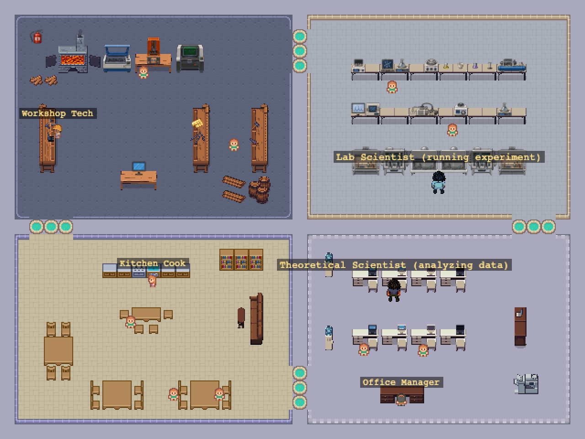

# Automated Lab



A browser-based, top-down 2D "virtual lab" - Pokémon-style movement and dialogue -
loosely inspired by the *Generative Agents* paper (`Paper/2304.03442v2.pdf`) and Andrew
White's drugcrow.ai concept. Two autonomous LLM-agent scientists (`lab_scientist`,
`theoretical_scientist`) run a real closed-loop science task around the clock - walking
between rooms, running experiments, analyzing data, and occasionally chatting with each
other - while any number of human visitors can log in, walk around, watch, and talk to
them or to the in-world computer terminals. The screenshot above is the whole map at
once (`?birdseye=1`, see below): Workshop top-left, Primary Lab top-right, Kitchen
bottom-left, Office bottom-right, every character - the two agents, the three named
flavor NPCs, and all 9 background workers - now rendered with its own distinct sprite
rather than a shared placeholder tile.

See `lab_sketch/SKETCH.png` for the real floor-plan this loosely riffs on.

## Quick start

```bash
# Node 20+ needed; if you don't have one:
conda create -n automated_lab -c conda-forge nodejs=22 -y
conda activate automated_lab

npm install
cp server/.env.example server/.env   # fill in GEMINI_API_KEY (free at aistudio.google.com)
npm run dev                          # client (Vite, :5173) + server (Socket.IO, :3001)
```

Open http://localhost:5173. The login screen offers **Visitor** (pick a name and a
male/female character - ephemeral, no persistence) or **Log In** (two named accounts
only, password-protected and persisted - see "Login & human accounts" below). Without
`GEMINI_API_KEY` set, everything else still works - the computer terminals and talking
to the two agents will show a visible error instead of crashing.

## Two ways to run it: simulation vs. display-only

The two agents' behavior is controlled by `SIMULATION_MODE` in `server/.env`:

- **`live` (the default)** - the real thing. Each agent runs its own decision loop
  (~every 2 minutes) backed by Gemini: choosing what to do next, running experiments,
  analyzing data, walking the map with real pathfinding, occasionally talking to each
  other. This is genuinely evolving - new experiment data, new memory, new conversation
  every time - but it costs LLM tokens continuously for as long as the server runs.
- **`replay`** - a fixed recorded session loops on repeat with **no background decision
  loop running at all**, so the two agents cost zero LLM tokens no matter how long it
  plays. Useful for a public demo or just leaving the tab open without burning API
  credits. A human's own chat with the terminals or the two agents still calls Gemini
  normally in either mode - replay only affects the two background agents' own
  behavior, not human interaction. By default it bakes the database's most recent
  `live` session; set `REPLAY_WINDOW_START` (ISO-8601) and `REPLAY_WINDOW_HOURS`
  together to pin it to a specific recorded window instead (see
  `server/.env.example`) - e.g. the live deployment currently replays a 3.5-hour
  window from `2026-09-11T07:00:42.955Z`, which bakes down to about 18 minutes of
  actual loop playback (each recorded decision holds for 10s - see
  `HOLD_DURATION_MS` in `server/src/replay/replayEngine.ts` - rather than the ~2
  real minutes it took live) before repeating.

## The world & characters

Four rooms - Workshop, Primary Lab, Kitchen/Corridor, Office - connected by door gaps,
real-time multiplayer movement, and a shared collision system (see below). Every
character now has its own sprite, extracted from LPC-format character sheets generated
via the [Universal LPC Spritesheet Character Generator](https://liberatedpixelcup.github.io/Universal-LPC-Spritesheet-Character-Generator)
(`client/scripts/extract-npc-sprite.py` for static NPCs, `extract-player-sprite.py` for
the player and the two agents), each posed at a specific facing direction (and, for
three of them, seated) chosen per-character:

- **The two LLM agents** - `lab_scientist` (experimentalist, based at the Primary Lab
  terminal) and `theoretical_scientist` (theorist, based at the Office desk) - have a
  full walk cycle each that switches outfit between the Lab and every other room, not
  just a static portrait.
- **3 named flavor NPCs** with canned dialogue - `workshop_tech`, `kitchen_cook`,
  `office_manager`.
- **9 background worker NPCs** (2 Workshop, 2 Lab, 2 Office, 3 Kitchen - e.g.
  "Machinist", "Lab Safety Officer") with their own 2-line canned dialogue and no
  floating name label, meant to populate a room without drawing attention the way a
  named character does. All three Kitchen workers are seated, each facing a different
  direction.
- **The player character** - pick male or female at login; both are full LPC-format
  walk/sit cycles that switch outfit by room (Lab vs. everywhere else), for both your
  own view and everyone else's.

The two in-world computer terminals (Lab, Office) each have a floating name label so
they're identifiable without walking up to them. Loading the client with `?birdseye=1`
(e.g. `http://localhost:5173/?birdseye=1`) zooms the camera out to fit the whole map,
hides the chat/agent-log panels and your own sprite/nametag, and additionally marks
every spawn point with a highlighted tile + label - useful for regenerating
`docs/lab-birdseye.png` after a map edit; none of that spawn-point marking shows up
during normal play. Log in as usual; the view switches once the map scene starts.

## The science task

The two agents' work (`server/src/science/crystalDomain.ts`, `experimentLog.ts`) is a
fictional but internally-consistent "chaotic layered crystals" domain, loosely modeled
on real SiC/ZnS polytype stacking-fault physics: a material is a sequence of "H"/"C"
stacking symbols, and the search space grows as 2^N, so the task has no ceiling. Each
measurement carries realistic synthetic instrument noise (bulk modulus has a genuine
quadratic instrument-response curve to ground truth, not just linear+noise).

The two computer terminals are grounded in this real data
(`server/src/science/terminalVisualization.ts`): the Lab terminal renders a
theory-vs-experiment parity plot with real measurement uncertainty, the Office terminal
renders a structure diagram plus an information-content/bulk-modulus scatter plot across
recent runs, and both terminals' chat (and chatting with either agent directly) is
grounded in the actual experiment log and that agent's own memory instead of a generic
prompt.

**Not yet done:** the theorist's analysis doesn't feed back into the experimentalist's
next configuration choice - each agent's decision loop runs independently.

## Login & human accounts

The login screen (`client/src/ui/LoginForm.ts`) offers two paths:

- **Visitor** - any name except one of the two reserved account names (any case -
  rejected with an inline error so no one can impersonate a real account) plus a
  male/female pick. Fully ephemeral: fresh random spawn every time, own state never
  persisted.
- **Log In** - the two named accounts only, real username/password
  (`server/src/accounts/humanAccounts.ts`), checked against a password env var per
  account (see `server/.env.example` for the exact names) - a plain equality check,
  not hashed - fine for a small trusted group, not a real auth system. A wrong
  password, or logging in as an account that's already connected elsewhere (**single
  session per account** - no two sockets can represent the same identity), shows an
  inline error and leaves the form open rather than failing silently.

A successful login resumes at that account's last known position/facing instead of a
random spawn - see Persistence below for exactly what's saved.

**Capacity:** at most `MAX_CONNECTED_HUMANS` (20, see `server/src/game/state.ts`)
people - Visitors and named accounts counted together - can be connected at once, since
this is served from a single small always-on VM (see Deployment below). Once full, both
a Visitor join and a Log In attempt are refused with an inline "the lab is full" message
on the login screen rather than silently degrading performance for everyone already in.

## Persistence

`server/src/db/index.ts` opens a SQLite database at `server/data/lab.sqlite`
(git-ignored; `:memory:` under the test runner) that backs agent memory, the experiment
log/target, the activity feed, and each agent's position - all of it survives a server
restart, and is what `replay` mode bakes its loop from.

The two named accounts (see Login & human accounts above) are also persisted, in two
more tables: `human_snapshot` (last known x/y/facing, one row per account, overwritten -
not a movement history) and `human_interaction_log` (their own turns in an NPC-agent
chat or on a computer terminal - a Visitor's equivalent sessions are never written
here).

The **public chat log** (`public_chat_log` table) is different from both: it records
everything said by anyone - a named account or a Visitor (labeled `"<name> (visitor)"`),
plus a `"<name> (visitor) has left."` system notice on a Visitor's disconnect - and
survives a restart regardless of who sent it. A newly-joined Visitor only sees chat sent
after they arrive (nothing retroactive); logging in as a named account instead loads the
whole persisted history.

## Deployment

Live at **https://automated-lab-client.vercel.app** (client) talking to
**https://automated-lab.fly.dev** (server) - client and server deploy separately since
the server needs a long-lived WebSocket process and a persistent disk (neither fits a
serverless host), while the client is a static Vite build.

- **Server (Fly.io):** `Dockerfile` runs `@lab/server` straight from TypeScript via
  `tsx` (no build step - `shared` has no build script and is meant to be consumed as
  source by both `tsx` and Vite). `fly.toml` mounts a 1GB volume at `server/data` for
  `lab.sqlite`, so agent memory/experiment history, the two named accounts' own state,
  and the public chat log (see Persistence above) all survive redeploys. Secrets
  (`GEMINI_API_KEY`, `CLIENT_ORIGIN`, and the two account password env vars) live in
  Fly secrets, not in git; non-secret config (`SIMULATION_MODE`, `REPLAY_WINDOW_START`,
  `REPLAY_WINDOW_HOURS` - see "Two ways to run it" above) lives directly in `fly.toml`'s
  `[env]` block instead, since there's nothing sensitive about them.
  Redeploy with `flyctl deploy --app automated-lab` from the repo root.
- **Client (Vercel):** project root directory is set to `client/` (via
  `vercel project update automated-lab-client --root-directory client`, not
  `vercel.json` - a bare `rootDirectory` key there fails schema validation), so `npm
  install` still runs at the repo root and resolves the `@lab/shared` workspace
  correctly. `VITE_SERVER_URL` (production env var) points at the Fly server.
  Redeploy with `vercel --prod --yes` from the repo root.
- Changing either URL means updating the other side: a new client URL needs
  `flyctl secrets set CLIENT_ORIGIN=<url> --app automated-lab` (CORS), and a new server
  URL needs the `VITE_SERVER_URL` env var updated in the Vercel project and redeployed.

## Editing the map

`client/public/assets/map/lab.json` is a **hand-edited Tiled map**, not generated code -
edit it directly in the [Tiled](https://www.mapeditor.org/) app. The original generator,
`client/scripts/generate-map.mjs`, produced the very first version (a 40x30 tile world,
four quadrants, door gaps) but **must not be re-run now** - it would silently overwrite
every manual edit since. Keep it around only as a reference for the original layout
constants.

Workflow for picking up a new edit: copy the edited file over
`client/public/assets/map/lab.json`, then before trusting it, sanity-check that walls
didn't accidentally cut off a room -

```bash
python3 - <<'EOF'
import json
from collections import deque
m = json.load(open('client/public/assets/map/lab.json'))
walls = next(l for l in m['layers'] if l['name']=='walls')
W, H = walls['width'], walls['height']
data = walls['data']
blocked = lambda x,y: x<0 or x>=W or y<0 or y>=H or data[y*W+x]!=0
seen = {(3,17)}
q = deque(seen)
while q:
    x,y = q.popleft()
    for dx,dy in [(1,0),(-1,0),(0,1),(0,-1)]:
        if (x+dx,y+dy) not in seen and not blocked(x+dx,y+dy):
            seen.add((x+dx,y+dy)); q.append((x+dx,y+dy))
npcs = next(l for l in m['layers'] if l['name']=='npcs')
computers = next(l for l in m['layers'] if l['name']=='computers')
for o in npcs['objects'] + computers['objects']:
    tx, ty = int(o['x']//16), int(o['y']//16)
    print(o['name'], 'reachable' if any((tx+dx,ty+dy) in seen for dx in (-1,0,1) for dy in (-1,0,1)) else '** UNREACHABLE **')
EOF
```

then run `npm run test` (the connectivity test in `server/src/game/collision.test.ts`
does the same check automatically) and restart the server, since it reads the map file
once at boot (`server/src/data/mapMeta.ts`).

### Adding a new tileset

Add it in Tiled (New Tileset, 16x16, margin 0, spacing 0), save the map, then register
it in `client/src/scenes/mapTilesets.ts` (Tiled tileset name -> Phaser texture key ->
image path) and drop the image under `client/public/assets/tilesets/`. Every tile layer
in the map renders automatically (`MainScene.ts` loops over `map.layers`), so no other
code changes are needed - a layer or tileset that isn't registered there is the most
common cause of "some tiles aren't showing up."

If a tileset's source art isn't already on a 16x16 grid, downscale/pack it first - see
`client/scripts/pack-lpc-office.py` (and `lpc_pack_common.py`) for the pattern. **Never
regenerate an already-in-use packed sheet** without diffing the output first: which
files get excluded/included changes every item's position in the packed sheet, which
silently breaks any tiles already placed against the old layout in the live map.

## Movement & collision

Both the server (authoritative) and the client (local prediction) call the *same*
`resolveMove` function from `shared/src/collision.ts` against their own copy of the
"walls" tile layer - not just similar logic, the literal same code. It rejects a move
outright if the destination overlaps a wall tile, rather than moving into it and
separating back out (which is what Phaser's Arcade-physics colliders do by default).
Keep it this way: if client and server ever run different collision logic again, they
will eventually visually disagree near a wall boundary, however subtly.

## Tests

```bash
npm run test       # server-side vitest: collision/movement, join/login (incl. gender,
                    # reserved names, wrong password, concurrent-session rejection,
                    # position resume), chat broadcast + persistence scoping, visitor
                    # departure announcement, NPC proximity gating, terminal error path
npm run typecheck   # all three workspaces
```

There's no browser automation in this repo - verify actual gameplay manually with
multiple browser tabs. Worth checking each time you touch movement/UI:

- Walking into walls in all four rooms doesn't clip through them, but the door gaps
  between rooms do let you through.
- Two+ tabs see each other move smoothly, with the correct male/female sprite for each;
  closing a tab removes that player for everyone else.
- Walking up to an NPC or either agent (facing it) shows an interact prompt; talking
  opens a dialogue box and blocks movement until closed; other players are unaffected.
- Chat messages appear in every connected tab. A newly-joined Visitor tab starts with
  an empty log (no retroactive history); logging in as a named account instead shows
  the full persisted history immediately.
- Using a computer terminal round-trips through the server only - check the browser's
  network tab and confirm there is never a direct request to
  `generativelanguage.googleapis.com`, only same-origin Socket.IO traffic.

## Art & asset credits

Everything below is used under its stated license; keep this list in sync with
`client/src/scenes/mapTilesets.ts` and `client/public/assets/sprites/` when adding more.

| Asset | License | Credit |
|---|---|---|
| Kenney "RPG Urban Pack" (base tiles, computer-terminal props) | CC0 | Kenney (kenney.nl) |
| Cute RPG World - RPG Maker MZ (16x16) (kitchen dressing) | Free (personal/commercial, no resale) | PixyMoon (pixymoon.itch.io) |
| Land of Pixels "Laboratory tileset PixelArt 16px" (lab floor/props) | CC-BY 4.0 | Land of Pixels |
| [LPC] The Office (office props) | OGA-BY 3.0 | Eliza Wyatt (DeathsDarling), Lanea Zimmerman (Sharm) |
| LPC Furniture pack (general furniture, Smithing/workshop props) | OGA-BY 3.0 | Lanea Zimmerman (Sharm), Eliza Wyatt (DeathsDarling), BlueCarrot16, YuriNikolai |
| LPC Small Items pack (tools, ores, clutter, food) | OGA-BY 3.0 | Eliza Wyatt (DeathsDarling), Lanea Zimmerman (Sharm), BlueCarrot16, Richard Kettering (Jetrel) |
| [LPC] Alchemy (chemistry-lab glassware/apparatus) | CC-BY-SA 3.0 / 4.0 | bluecarrot16, Lanea Zimmerman (Sharm), PriorBlue, Jerom, Wolthera van Hövell tot Westerflier (TheraHedwig); commissioned by MedicineStorm |
| Factory Tileset (workshop machines, conveyor belt, server racks/monitors) | CC0 | OpenGameArt.org, made for KeyserEX |
| Modern Machines (CNC mill/lathe/router, 3D printers, laser cutter, workshop tools/materials/signage - 55 icons auto-extracted from a reference sheet via `client/scripts/pack-ai-modern-machines.py`) | User-provided (Keith), AI-generated | - |
| Automated Lab (analytical/wet-lab instruments, glassware, tools, fittings, monitor/signage icons, GHS hazard diamonds - 70 icons auto-extracted from a reference sheet via `client/scripts/pack-ai-automated-lab.py`) | User-provided (Keith), AI-generated | - |
| Glassware (flasks, beakers, test tubes, funnels, condensers, stoppers/joints, retort stands/clamps, small hardware - 312 icons auto-extracted from a reference sheet via `client/scripts/pack-ai-glassware.py`) | User-provided (Keith), AI-generated | - |
| Player character spritesheets (male + female, Lab/outside outfits, full walk+sit cycles) | CC-BY-SA 3.0 / GPL 3.0 (per the generator's combined assets) | Generated via the [Universal LPC Spritesheet Character Generator](https://liberatedpixelcup.github.io/Universal-LPC-Spritesheet-Character-Generator); Liberated Pixel Cup / OpenGameArt contributors |
| The two LLM agents' character spritesheets (Lab/outside outfits, full walk cycles) | CC-BY-SA 3.0 / GPL 3.0 (per the generator's combined assets) | Generated via the [Universal LPC Spritesheet Character Generator](https://liberatedpixelcup.github.io/Universal-LPC-Spritesheet-Character-Generator); Liberated Pixel Cup / OpenGameArt contributors |
| All 12 static NPC portraits (3 named + 9 background workers, one static pose each) | CC-BY-SA 3.0 / GPL 3.0 (per the generator's combined assets) | Generated via the [Universal LPC Spritesheet Character Generator](https://liberatedpixelcup.github.io/Universal-LPC-Spritesheet-Character-Generator); Liberated Pixel Cup / OpenGameArt contributors |
